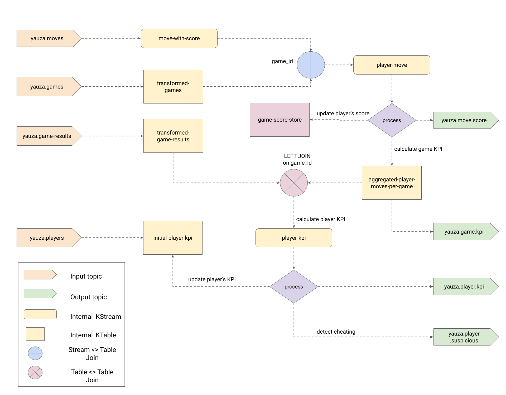

# Chess Cheater Detection

Lichess.org provides an open API that offers information about chess games and players. This information is used to calculate statistics about players and to identify instances where a player might be using a chess engine to generate their moves.

## Producers
Four types of Kafka producers are created, each responsible for querying the Lichess API and producing its output to Kafka topics:

1. **Games Producer**: Queries https://lichess.org/api/tv/bullet to obtain a list of currently active bullet games. The output of this producer includes information such as the game ID, white and black player IDs, and more.

2. **Moves Producer**: Queries https://lichess.org/api/stream/game/{gameId} to get a stream of moves in a single game. The output contains information about each move played and the index of the move in the game.

3. **Game Result Producer**: Similar to the `Moves Producer` this producer queries the same API (https://lichess.org/api/stream/game/{gameId}) but ignores move messages. It only forwards game-related messages and transforms them to obtain information about the game's result.

4. **Players Producer**: Queries https://lichess.org/api/user/{userId} to gather information about players, including their current rank in different game modes and total games played, among other details.

**NOTE**: Producers may produce duplicate messages for the same event.

Produced messages adhere to schemas described at `lichess.api` for corresponding API calls. Some commonly used abbreviations are:
```
fen : Forsyth-Edwards Notation is the standard notation to describe positions of a chess game
bc, wc: black counter, white counter, reprsents time left for each player in seconds
perf: user’s performance for each game variant (e.g. blitz, bullet..) 
```


### Topics
**Input topics**:
- `yauza.moves`
- `yauza.games`
- `yauza.game-results`
- `yauza.players`

**Output topics**:
- `yauza.move.score`
- `yauza.game.kpi`
- `yauza.player.kpi`
- `yauza.player.suspicious`

| Topic                 | Cleanup Policy |
|-----------------------|----------------|
| yauza.games           | delete         |
| yauza.moves           | delete         |
| yauza.game-results    | delete         |
| yauza.players         | compact        |
| yauza.move.score      | delete         |
| yauza.game.kpi        | compact        |
| yauza.player.kpi      | compact        |
| yauza.player.suspicious | delete         |

**NOTE**: All topics are configured with `compression.type: gzip`.

## Consumer
The Kafka Streams application consumes input topics and performs aggregation and transformation on messages to calculate various KPIs for both players and games.

### Topology
The Kafka Streams application's topology is shown below:



### Tasks
1. Deduplicate messages from each topic.
2. Use the players producer as an "initial import" of the players, considering only the first message for each unique player. The goal is to use Yauza to calculate player statistics over time.
3. Define a move's category using the Stockfish engine ([Stockfish's UCI](https://gist.github.com/aliostad/f4470274f39d29b788c1b09519e67372)) and calculate the score for the player after that move.
4. For each game, calculate the following KPIs:
   1. Number of `Brilliant` moves.
   2. Number of `Excellent` moves.
   3. Number of `Good` moves.
   4. Number of `Inaccuracy` moves.
   5. Number of `Mistake` moves.
   6. Number of `Blunder` moves.
   7. Player's accuracy.
5. For each player, calculate the following KPIs:
   1. Win count.
   2. Loss count.
   3. Draw count.
   4. Rated games count.
   5. Number of played games.
   6. Win/Loss ratio.
   7. Number of total correct/incorrect moves.
   8. Correct/Incorrect moves ratio.
   9. Mean player's accuracy: Number of correct moves / Total number of moves.
   10. Macro accuracy: Average of accuracies for each game that the player played.
   11. Median accuracy: 50th percentile of the accuracies of every game played.
   12. Standard deviation of accuracy.
6. Detect potential cheaters: If a player has three or more games where their accuracy follows:
```
      gameAccuracy >= meanPlayerAccuracy + 2 * STD
 ```


## Infrastructure
The producer and consumer applications, along with the Kafka cluster and Schema registry, are deployed using Docker containers. The containers are orchestrated using the `docker-compose` tool. Configuration details can be found in the `./infrastructure/docker-compose.yml` file. All relevant files for setting up and deploying the cluster are inside [infrastucture folder](https://github.com/spcnz/chess_cheater_detection/tree/main/infrastructure).
